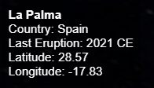
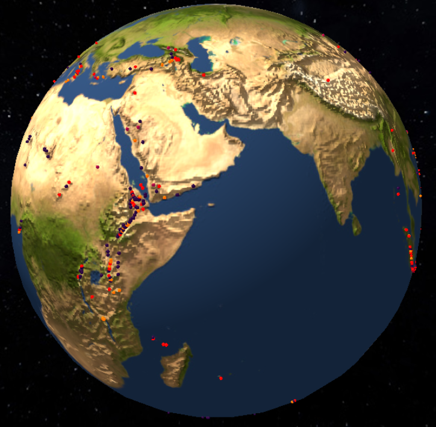
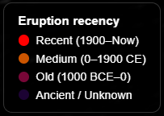

# Tarea S8 IG - Leslie Liu Romero Martín

## Link de CodeSandbox

- https://codesandbox.io/p/sandbox/ig-tarea-s8-entrega-3v3nf5

## Link al vídeo

- https://drive.google.com/file/d/1oUVA-_ZqfKkGFub29gwtQ87WhH1MXa2_/view?usp=sharing

## Introducción

Para esta tarea de visualización de datos, tenía interés en representar fenómenos naturales en el globo terráqueo. Finalmente, por facilidad de representación y la disponibilidad de un dataset, me decidí a representar volcanes.

## Dataset

El dataset lo pude conseguir con la ayuda de la IA generativa en el siguiente enlace: https://volcano.si.edu/volcanolist_holocene.cfm del Museo Nacional de Historia Natural Smithsonian. Me descargué el archivo en el formato que ofrecen (XML Excel) y me encargué de eliminar las columnas que no fueran de interés y convertir el archivo a CSV.

## Implementación básica

Para comenzar la implementación, me centré en simplemente mostrar la ubicación de los volcanes en el globo terráqueo. Previamente generado el planeta Tierra con las funciones que hemos usado en prácticas anteriores, aunque adaptada para utilizar solo los parámetros necesarios:

```js
function Planeta(
  radio,
  res,
  col,
  texture = undefined,
  texbump = undefined,
  texspec = undefined
) {
    let geom = new THREE.SphereGeometry(radio, res, res);
    let mat = new THREE.MeshPhongMaterial({ color: col });
    if (texture != undefined) {
      mat.map = texture;
    }
    // Textura
    if (texture != undefined) {
      mat.map = texture;
    }
    // Rugosidad
    if (texbump != undefined) {
      mat.bumpMap = texbump;
      mat.bumpScale = 1;
    }
    // Especular
    if (texspec != undefined) {
      mat.specularMap = texspec;
      mat.specular = new THREE.Color("orange");
    }
    
    let planeta = new THREE.Mesh(geom, mat);
  
    Tierra = planeta;
    scene.add(planeta);
}
```

Creamos la tierra en el `init()` como siempre:
```js
Planeta(1.5, 30, 0xffffff, txtEarthDay, txtEarthBump, txtEarthSpec);
console.log("Creada la Tierra");
```

Y tras este proceso, pasamos finalmente al procesamiento de los datos para mostrar los volcanes en el globo terráqueo. Primero, tenemos la función para procesar los datos, basada en uno de los ejemplos:

```js
function procesarCSV(content) {
  const sep = ";"; // separador ;
  const filas = content.split("\n");

  // Primera fila es el encabezado, separador ;
  const encabezados = filas[0].split(sep).map(h => h.trim());
  // Obtiene índices de columnas de interés
  const indices = {
    nombre: encabezados.indexOf("Volcano Name"),
    pais: encabezados.indexOf("Country"),
    ultimaErupcion: encabezados.indexOf("Last Known Eruption"),
    lat: encabezados.indexOf("Latitude"),
    lon: encabezados.indexOf("Longitude")
  };

  // Extrae los datos de interés de las estaciones
  for (let i = 1; i < filas.length; i++) {
    const columna = filas[i].split(sep); // separador ;
    if (columna.length > 1) {
      // No fila vacía, almacena datos
      datosVolcanes.push({
        nombre: columna[indices.nombre],
        pais: columna[indices.pais],
        ultimaErupcion: columna[indices.ultimaErupcion],
        lat: columna[indices.lat],
        lon: columna[indices.lon]
      });

      const lat = parseFloat(columna[indices.lat]);
      const lon = parseFloat(columna[indices.lon]);

      if (!isNaN(lat) && !isNaN(lon)) {
        const pos = latLonToVector3(lat, lon, 1.5);
        const geometry = new THREE.SphereGeometry(0.008, 8, 8);
        const material = new THREE.MeshPhongMaterial({
          color: markerColor(columna[indices.ultimaErupcion]),
          emissive: markerColor(columna[indices.ultimaErupcion])
        });
        const marker = new THREE.Mesh(geometry, material);
        marker.position.copy(pos);

        marker.userData = {
          nombre: columna[indices.nombre],
          pais: columna[indices.pais],
          ultimaErupcion: columna[indices.ultimaErupcion],
          lat,
          lon
        };

        Tierra.add(marker);
      }
    }
  }
  console.log("Archivo CSV cargado");
}
```

Esta función está compuesta de distintas partes, primero el procesamiento de las filas y columnas del CSV, luego el cálculo de las coordenadas (x, y, z) equivalentes en el globo dada la latitud y longitud, usando la función `latLonToVector3()`:

```js
function latLonToVector3(lat, lon, radius = 1) {
    const phi = (90 - lat) * (Math.PI / 180);
    const theta = (lon + 180) * (Math.PI / 180);
  
    const x = -(radius * Math.sin(phi) * Math.cos(theta));
    const y = radius * Math.cos(phi);
    const z = radius * Math.sin(phi) * Math.sin(theta);
  
    return new THREE.Vector3(x, y, z);
}
```
Y como última parte, se crea la esfera del `marker`, que representa la ubicación del volcán y a la cual se le aporta un tamaño, color y datos de usuario que se utilizarán posteriormente.

## Rotación y texturas

Como no quería que la Tierra se mantuviese estática, decidí aplicarle una simple rotación que diese dinamismo a la escena. Esto se implementa de manera muy sencilla modificando la rotación del objeto Tierra en el `animate()`:

```js
if (rotation && Tierra) {
  Tierra.rotation.y -= 0.01;
}
```
Y por supuesto, para mayor flexibilidad y ya que implementé algo similar en la práctica anterior, le añadí un botón de pausa para que el usuario pueda elegir entre observar la Tierra en movimiento con los puntos o usar los `orbitControls` para mover la escena.


Con respecto a las texturas, evitentemente había que añadir cierta textura para que fuese atractivo apreciar los puntos de los volcanes en el mapamundi, sin embargo, también decidí añadir el `bumpMap` de la práctica anterior para añadir cierta sensación de relieve así como una textura de espacio que se encuentra pegada en el interior de una esfera, para que fuese más inmersivo.

*Inserción de las texturas cambiando el colorSpace para que los colores originales se aprecien más.*
```js
const txtSpace = new THREE.TextureLoader().load(
  "src/textures/2k_stars_milky_way.jpg"
);
txtSpace.colorSpace = THREE.SRGBColorSpace;
const txtEarthDay = new THREE.TextureLoader().load(
  "src/textures/2k_earth_daymap.jpg"
);
txtEarthDay.colorSpace = THREE.SRGBColorSpace;
const txtEarthSpec = new THREE.TextureLoader().load(
  "src/textures/2k_earth_specular_map.tif"
);
txtEarthSpec.colorSpace = THREE.SRGBColorSpace;
const txtEarthBump = new THREE.TextureLoader().load(
  "src/textures/earthbump1k.jpg"
);
txtEarthBump.colorSpace = THREE.SRGBColorSpace;
```

*Textura de la tierra con el bumpMap*
```js
Planeta(1.5, 30, 0xffffff, txtEarthDay, txtEarthBump, txtEarthSpec);
```

*Textura del espacio en el interior de una esfera*
```js
const starGeo = new THREE.SphereGeometry(90, 64, 64);
  const starMat = new THREE.MeshBasicMaterial({
    map: txtSpace,
    side: THREE.BackSide
  });
  const starField = new THREE.Mesh(starGeo, starMat);
  scene.add(starField);
```
## Interacción con los puntos (eventos de ratón)

Una vez obtenida la visión de la tierra y la ubicación de los volcanes, el siguiente paso era añadir alguna interacción. Me decidí por mostrar la información que consideré relevante del dataset: Nombre del volcán, el país al que pertenece, la última erupción y su ubicación (latitud y longitud).

Tal y como se pudo ver anteriormente, se guarda la información en la variable `userData` del `marker` al crearlo:
```js
marker.userData = {
  nombre: columna[indices.nombre],
  pais: columna[indices.pais],
  ultimaErupcion: columna[indices.ultimaErupcion],
  lat,
  lon
};
```

Posteriormente, creamos un evento de ratón para que, al hacer click, se muestren los datos del volcán en la pantalla:
```js
window.addEventListener("click", onClick, false);
function onClick(event) {
    mouse.x = (event.clientX / window.innerWidth) * 2 - 1;
    mouse.y = -(event.clientY / window.innerHeight) * 2 + 1;

    raycaster.setFromCamera(mouse, camera);

    const intersects = raycaster.intersectObjects(Tierra.children, true);

    if (intersects.length > 0) {
      const marker = intersects[0].object;
      if (marker.userData) {
        showVolcanoInfo(marker.userData);

        if (selectedMarker) {
          let color = markerColor(selectedMarker.userData.ultimaErupcion);
          selectedMarker.material.color.set(color);
          selectedMarker.material.emissive.set(color);
        }
        
        marker.material.color.set(0xffff00);
        marker.material.emissive.set(0xffff00);
        selectedMarker = marker;
      }
    } else {
      if (selectedMarker) {
        let color = markerColor(selectedMarker.userData.ultimaErupcion);
        selectedMarker.material.color.set(color);
        selectedMarker.material.emissive.set(color);
        selectedMarker.scale.set(1, 1, 1)
        hideVolcanoInfo();
      }
    }
  }
```
Obviamente, necesitábamos una función para añadir el texto a la pantalla:
```js
function showVolcanoInfo(data) {
  info.classList.remove("info");
  info.classList.add("volcano-info");
  info.innerHTML = `
    <strong>${data.nombre}</strong><br>
    Country: ${data.pais}<br>
    Last Eruption: ${data.ultimaErupcion}<br>
    Latitude: ${data.lat}<br>
    Longitude: ${data.lon}
  `;
}
```


Y para ocultarla:
```js
function hideVolcanoInfo() {
  info.classList.remove("volcano-info");
  info.classList.add("info");
  info.innerHTML = "Práctica S8 - Leslie Romero";
}
```

Pero volviendo al evento de click, dentro de esta función hay que tener en cuenta varios factores, ya que cambiamos el color para que, cuando se haga click, el usuario sepa en qué volcán ha hecho click. Esto conlleva que, cuando se haga click en otro volcán o en un punto donde no haya un volcán, se recupere el color original.


Además, probando con esta función de click, me di cuenta de que hay veces que, por el tamaño tan pequeño de los puntos, es un poco difícil saber si la interacción entre el ratón y el punto se está realizando o no, por lo que decidí también implementar una función `onHover` que aumenta ligeramente el tamaño de la esfera del volcán cuando pasas por encima.

```js
function onHover(event) {
    mouse.x = (event.clientX / window.innerWidth) * 2 - 1;
    mouse.y = -(event.clientY / window.innerHeight) * 2 + 1;
  
    raycaster.setFromCamera(mouse, camera);
    const intersects = raycaster.intersectObjects(Tierra.children, true);
  
    Tierra.children.forEach(marker => {
      if (marker !== selectedMarker) marker.scale.set(1, 1, 1);
    });
  
    if (intersects.length > 0) {
      const marker = intersects[0].object;
      if (marker !== selectedMarker) marker.scale.set(1.2, 1.2, 1.2);
    }
  }
```

En este caso, también hay que tener cuidado con dejar las esferas en su estado original.


## Color de los puntos y leyenda

Una vez estaban implementados los eventos de ratón, me pareció lo más adecuado añadir algún tipo de distinción entre los puntos. Ya que teníamos el dato de la última erupción, elegí filtrar por cuántos años hacía que había erupcionado por última vez cada volcán y asignarle un color. Esto complicó ligeramente la lógica de otras funciones que utilizaban el color, como los eventos de ratón, por lo que facilité los cálculos con una función:

```js
function markerColor(lastEruption) {
  if (lastEruption.includes("Unknown")) {
    return 0x1C0333;
  }

  let year = parseInt(lastEruption);

  if (lastEruption.includes("BCE")) {
      year += 2025
  }

  let yearsPassed = 2025 - year;

  if (yearsPassed <= 100) return 0xff0000;
  if (yearsPassed <= 1000) return 0xCC5500;
  if (yearsPassed <= 10000) return 0x770737;
  return 0x1C0333;
  
}
```



Y por supuesto, cuando hay cualquier tipo de representación gráfica de este tipo, había que añadir una leyenda para que el usuario pudiese comprenderlo:
```js
function createLegend() {
  const legend = document.createElement("div");
  legend.id = "legend-box";

  legend.innerHTML = `
      <strong style="font-size: 14px;">Eruption recency</strong><br>
      <div class="color-item"><span class="color-dot" style="background:#ff0000"></span> Recent (1900–Now)</div>
      <div class="color-item"><span class="color-dot" style="background:#cc5500"></span> Medium (0–1900 CE)</div>
      <div class="color-item"><span class="color-dot" style="background:#770737"></span> Old (1000 BCE–0)</div>
      <div class="color-item"><span class="color-dot" style="background:#1c0333"></span> Ancient / Unknown</div>
  `;

  document.body.appendChild(legend);
}
```



## Recursos

- Dataset: https://volcano.si.edu/volcanolist_holocene.cfm
